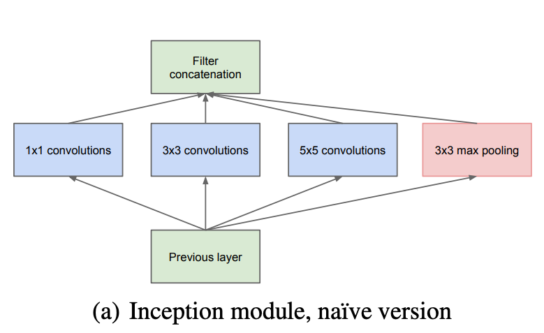
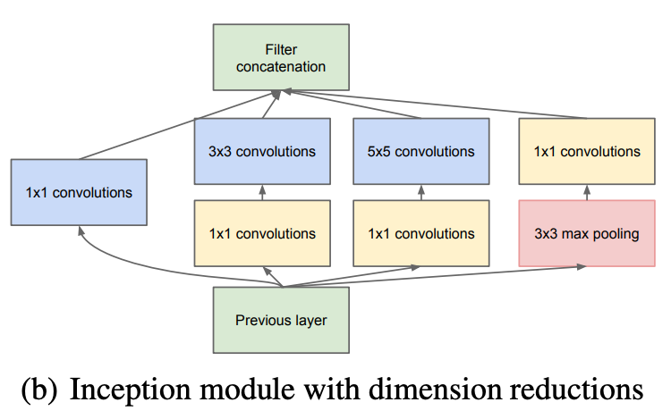
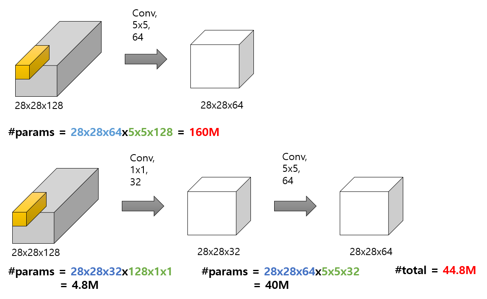

**Going Deeper with Convolutions(2015) Inception** 모듈에 대한 내용입니다. 해당 논문에서는 Inception Module이라는 새로운 neural network architecture 를 공개하였습니다. 논문의 제목과 같이 Going Deeper 즉 더욱 깊은 신경망 모델을 dimension reduction이 적용된 Inception Module로 가능케 하였는데, 이때 1x1 컨볼루션(Convolution)을 적극 활용하였습니다.

이때 활용한 1x1 컨볼루션이 어떤 역할을 하였는지 살펴보도록 하겠습니다.


🔥 논문은 다음의 링크를 참고해 주세요!

- Going Deeper with Convolutions(2015) [**(링크)**](https://arxiv.org/pdf/1409.4842v1.pdf)


---


먼저 아래 그림은 논문에서 나온 초기(naive) 버전의 Inception Module 입니다. 궁극적으로 아래의 Inception Module을 활용하여 이미지의 지역적 특성 추출을 효과적으로 수행할 수 있도록 구조를 설계하였습니다.

하나의 이미지 영역에 대하여 1x1, 3x3, 5x5 컨볼루션과 3x3 Maxpooling 층으로 특성 추출을 한 뒤 필터에 대한 concatenation을 수행합니다.

> 초기 버전의 Inception module




위의 그림대로 Inception Module을 구현한 코드는 아래와 같습니다.

```Python
import torch
import torch.nn as nn
import torchsummary

class BaseConv2D(nn.Module):
    def __init__(self, in_channels, out_channels, **kwargs):
        super(BaseConv2D, self).__init__()
        self.conv = nn.Conv2d(in_channels=in_channels, out_channels=out_channels, **kwargs)
        self.relu = nn.ReLU(inplace=True)
        
    def forward(self, x):
        return self.relu(self.conv(x))

        
class InceptionModuleV1(nn.Module):
    def __init__(self, in_channels, out_1x1, out_3x3, out_5x5, pool):
        super(InceptionModuleV1, self).__init__()
        self.conv1x1 = BaseConv2D(in_channels, out_1x1, kernel_size=1)
        self.conv3x3 = BaseConv2D(in_channels, out_3x3, kernel_size=3, padding='same')
        self.conv5x5 = BaseConv2D(in_channels, out_5x5, kernel_size=5, padding='same')
        self.pool = nn.Sequential(
            nn.MaxPool2d(kernel_size=3, stride=1, padding=1), 
            BaseConv2D(in_channels, pool, kernel_size=1, padding='same')
        )
    
    def forward(self, x):
        x1 = self.conv1x1(x)
        x2 = self.conv3x3(x)
        x3 = self.conv5x5(x)
        x4 = self.pool(x)
        return torch.cat([x1, x2, x3, x4], 1)
```

```python
# 입력 매개변수: in_channels, 1x1, 3x3, 5x5 컨볼루션 output 필터 사이즈, Maxpooling output 필터 사이즈
inception_module_V1 = InceptionModuleV1(192, 64, 128, 32, 32)
```

```python
# torchsummary 로 192 x 28 x 28 입력을 주었을 때의 파라미터 추정
torchsummary.summary(inception_module_V1, input_size=(192, 28, 28), device='cpu')
```

```
----------------------------------------------------------------
        Layer (type)               Output Shape         Param #
================================================================
            Conv2d-1           [-1, 64, 28, 28]          12,352
              ReLU-2           [-1, 64, 28, 28]               0
        BaseConv2D-3           [-1, 64, 28, 28]               0
            Conv2d-4          [-1, 128, 28, 28]         221,312
              ReLU-5          [-1, 128, 28, 28]               0
        BaseConv2D-6          [-1, 128, 28, 28]               0
            Conv2d-7           [-1, 32, 28, 28]         153,632
              ReLU-8           [-1, 32, 28, 28]               0
        BaseConv2D-9           [-1, 32, 28, 28]               0
        MaxPool2d-10          [-1, 192, 28, 28]               0
           Conv2d-11           [-1, 32, 28, 28]           6,176
             ReLU-12           [-1, 32, 28, 28]               0
       BaseConv2D-13           [-1, 32, 28, 28]               0
================================================================
Total params: 393,472
Trainable params: 393,472
Non-trainable params: 0
----------------------------------------------------------------
Input size (MB): 0.57
Forward/backward pass size (MB): 5.74
Params size (MB): 1.50
Estimated Total Size (MB): 7.82
----------------------------------------------------------------
```

28 x 28 크기의 사진 192장을 입력으로 주었을 때 학습 파라미터는 **383k** 정도가 나왔습니다.

## 1x1 컨볼루션을 활용한 dimension reduction

이제 1x1 Convolution을 적용한 Inception Module을 알아볼 차례입니다.

> dimension reductions 이 적용된 Inception Module




위의 그림은 Inception Module에 dimension reductions를 적용한 구조도입니다.

3x3, 5x5 컨볼루션을 통과하기 전에 **1x1 컨볼루션이 추가**된 것을 확인할 수 있습니다. 또한, 3x3 Maxpooling을 통과한 후 1x1 컨볼루션을 통과하는 것도 확인할 수 있습니다.

자, 그럼 1x1 컨볼루션을 추가한 의미는 무엇이며, 궁극적으로 어떻게 GoogLeNet의 모델의 학습 성과를 올릴 수 있었는지 살펴 보겠습니다.


> 파라미터 수 비교



위의 그림에서 

1. 첫 번째는 **1x1 컨볼루션을 활용하지 않고** 28x28 사진(특성맵) 64장을 만들어내는 결과이고
2. 두 번째는 **1x1 컨볼루션을 활용하여 dimension reduction을 수행** 후 28x28 사진(특성맵) 64장을 만들어내는 결과입니다.

<u>*(컨볼루션 연산시 zero-padding이 추가되어 Feature Map의 이미지는 줄어들지 않았음을 참고해 주세요!)*</u>


1. 첫 번째는 **160M의 학습 파라미터**가 사용되고,
2. 두 번째는 첫 번째 대비 학습 파라미터의 개수가 **44.8M**로 훨씬 더 적습니다.이유는 1x1 컨볼루션 32가 먼저 필터의 개수를 줄이고, 이후에 5x5컨볼루션 64가 수행되면서 연상량을 획기적으로 절약할 수 있었지만, **동일한 28x28x64의 아웃풋**을 낼 수 있습니다. 

이렇듯 **1x1 컨볼루션에 필터의 갯수를 줄여 연산량을 획기적으로 감소**할 수 있습니다. 이것이 바로 **dimension reductions의 핵심**입니다. 이렇게 1x1 컨볼루션에서 필터 개수를 줄인 뒤 다시 키우는 구조를 **BottleNeck** 이라고 부르기도 합니다.

결국, 이렇게 절약한 연산량 덕분에 더 깊은 모델을 생성해낼 수 있습니다. 


## Inception Module with dimension reductions 구현

class InceptionModuleV2(nn.Module):
    def __init__(self, in_channels, out_1x1, out_3x3_reduce, out_3x3, out_5x5_reduce, out_5x5, pool):
        super(InceptionModuleV2, self).__init__()
        self.conv1x1 = BaseConv2D(in_channels, out_1x1, kernel_size=1)
        

```python
class InceptionModuleV2(nn.Module):
    def __init__(self, in_channels, out_1x1, out_3x3_reduce, out_3x3, out_5x5_reduce, out_5x5, pool):
        super(InceptionModuleV2, self).__init__()
        self.conv1x1 = BaseConv2D(in_channels, out_1x1, kernel_size=1)
        
        self.conv3x3 = nn.Sequential(
            # 1x1 Convolution
            BaseConv2D(in_channels, out_3x3_reduce, kernel_size=1),
            # 3x3 Convolution
            BaseConv2D(out_3x3_reduce, out_3x3, kernel_size=3, padding='same')
        )
        self.conv5x5 = nn.Sequential(
            # 1x1 Convolution
            BaseConv2D(in_channels, out_5x5_reduce, kernel_size=1),
            # 5x5 Convolution
            BaseConv2D(out_5x5_reduce, out_5x5, kernel_size=5, padding='same')
        )
        
        self.pool = nn.Sequential(
            # Maxpooling
            nn.MaxPool2d(kernel_size=3, stride=1, padding=1), 
            # 1x1 Convolution
            BaseConv2D(in_channels, pool, kernel_size=1, padding='same')
        )
    
    def forward(self, x):
        x1 = self.conv1x1(x)
        x2 = self.conv3x3(x)
        x3 = self.conv5x5(x)
        x4 = self.pool(x)
        return torch.cat([x1, x2, x3, x4], 1)
```

```python
# 입력 매개변수: in_channels, 1x1, 3x3 reduction, 3x3, 5x5 reduction, 5x5, Maxpool reduction
inception_module_V2 = InceptionModuleV2(192, 64, 96, 128, 16, 32, 32)
```

```python
# torchsummary 로 192 x 28 x 28 입력을 주었을 때의 파라미터 추정
torchsummary.summary(inception_module_V2, input_size=(192, 28, 28), device='cpu')
```

```
----------------------------------------------------------------
        Layer (type)               Output Shape         Param #
================================================================
            Conv2d-1           [-1, 64, 28, 28]          12,352
              ReLU-2           [-1, 64, 28, 28]               0
        BaseConv2D-3           [-1, 64, 28, 28]               0
            Conv2d-4           [-1, 96, 28, 28]          18,528
              ReLU-5           [-1, 96, 28, 28]               0
        BaseConv2D-6           [-1, 96, 28, 28]               0
            Conv2d-7          [-1, 128, 28, 28]         110,720
              ReLU-8          [-1, 128, 28, 28]               0
        BaseConv2D-9          [-1, 128, 28, 28]               0
           Conv2d-10           [-1, 16, 28, 28]           3,088
             ReLU-11           [-1, 16, 28, 28]               0
       BaseConv2D-12           [-1, 16, 28, 28]               0
           Conv2d-13           [-1, 32, 28, 28]          12,832
             ReLU-14           [-1, 32, 28, 28]               0
       BaseConv2D-15           [-1, 32, 28, 28]               0
        MaxPool2d-16          [-1, 192, 28, 28]               0
           Conv2d-17           [-1, 32, 28, 28]           6,176
             ReLU-18           [-1, 32, 28, 28]               0
       BaseConv2D-19           [-1, 32, 28, 28]               0
================================================================
Total params: 163,696
Trainable params: 163,696
Non-trainable params: 0
----------------------------------------------------------------
Input size (MB): 0.57
Forward/backward pass size (MB): 7.75
Params size (MB): 0.62
Estimated Total Size (MB): 8.95
----------------------------------------------------------------
```


- **초기 버전**: 28 x 28 크기의 사진 192장을 입력으로 주었을 때 학습 파라미터는 **383k** 정도가 나왔습니다.
- **V2(dimension reductions 적용)**: 28 x 28 크기의 사진 192장을 입력으로 주었을 때 학습 파라미터는 **163k** 정도가 나왔습니다.

확실히 파라미터 개수가 큰 차이를 보여줍니다. 아래는 Inception Module V1, V2를 통과한 결과의 Shape 입니다.

```python
# 더미 데이터 생성 (192x28x28)
dummy_input = torch.randn(size=(1, 192, 28, 28))
# V1 통과
y1 = inception_module_V1(dummy_input)
# V2 통과
y2 = inception_module_V2(dummy_input)
# Shape 출력
print(y1.shape, y2.shape)
```

```
# 출력 결과
torch.Size([1, 256, 28, 28]) torch.Size([1, 256, 28, 28])
```


결과는 V1, V2 모두 동일한 Shape가 출력됨을 확인할 수 있습니다. 즉, **결과물의 Shape는 동일**하나 파라미터 차이가 약 **220k** 정도 납니다.
